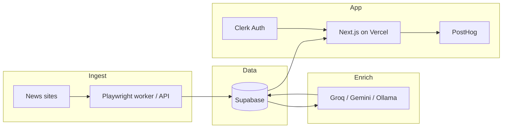

# Architecture — Axel News

English primary. Short Myanmar notes where helpful.

## Overview

Axel News is a free-tier Myanmar IT news pipeline:

1. **Ingest** articles via headless Chromium (Playwright/Puppeteer)
2. **Store** raw and cleaned content in Supabase
3. **Enrich** with free LLMs (summary, sentiment, bias)
4. **Present** in a Next.js UI (Tailwind + Framer Motion)
5. **Observe** with PostHog free analytics



## Components

| Component | Role | Free choice |
|-----------|------|-------------|
| Framework | SSR/SSG news UI + API routes | Next.js |
| Hosting | Deploy frontend/API | Vercel free |
| Database | Articles, embeddings later, metadata | Supabase free (~500MB) |
| Auth | Optional saved feeds / admin | Clerk free (~10k MAU) |
| Scraper | Fetch article HTML/text | Playwright or Puppeteer + Chromium |
| LLM | Summary / sentiment / bias | Groq → Gemini free → Ollama |
| Analytics | Product events | PostHog free (~1M events) |

## Article lifecycle

```text
Source URL
  → scrape (Playwright)
  → normalize (title, body, source, published_at, language)
  → insert row (Supabase)
  → enrich (LLM structured JSON)
  → update row (summary, sentiment, bias_notes)
  → list/detail UI (Next.js)
```

### Suggested article fields (planning only)

| Field | Notes |
|-------|-------|
| `id` | UUID |
| `source` | Site name / domain |
| `url` | Canonical URL (unique) |
| `title` | Headline |
| `body` | Cleaned text |
| `language` | `my` / `en` / mixed |
| `published_at` | Source time if known |
| `scraped_at` | Ingest time |
| `summary` | LLM short summary |
| `sentiment` | e.g. positive / neutral / negative |
| `bias_notes` | Short free-text bias hints |
| `enrichment_model` | Which free model produced output |

Schema implementation comes in a later roadmap phase.

## Runtime notes (free constraints)

### Scraping

- Prefer a **local or long-running worker** for Chromium.
- Next.js API routes on Vercel free are **not ideal** for heavy headless browsers (cold start, size, timeout).
- Document dual path: *dev/local worker first*, *light API scrape second*.

### LLM

- Default provider order: **Groq** (fast free tier) → **Gemini free** → **Ollama** (local, fully free).
- Always design for **rate-limit fallback** and structured JSON output.

### UI

- App Router + server components where data-heavy.
- Client components for Framer Motion interactions.
- Reusable news primitives: Card, Badge, Feed list, Article detail, Skeleton.

## Security & ethics (baseline)

- No secrets in the repo; use environment variables.
- Scrape only public pages; respect robots.txt and site terms where practical.
- Do not build bypasses for paywalls or anti-bot systems.
- Attribute sources; link back to originals.

## Myanmar note

> ဒီ architecture က paid scraper (Oxylabs) နဲ့ paid LLM (OpenAI/Anthropic) မသုံးဘဲ free stack နဲ့ Myanmar IT news pipeline တည်ဆောက်ဖို့ ရည်ရွယ်ပါတယ်။

## Related docs

- [free-stack.md](free-stack.md) — paid → free mapping
- [usage.md](usage.md) — agent skills & context
- [context/stack.md](context/stack.md) — tier limits
- [roadmap.md](roadmap.md) — build phases
